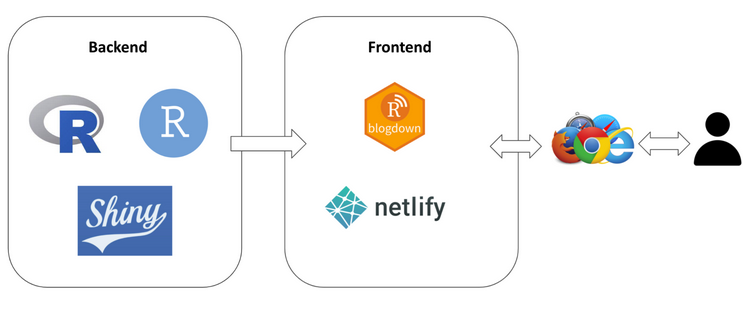
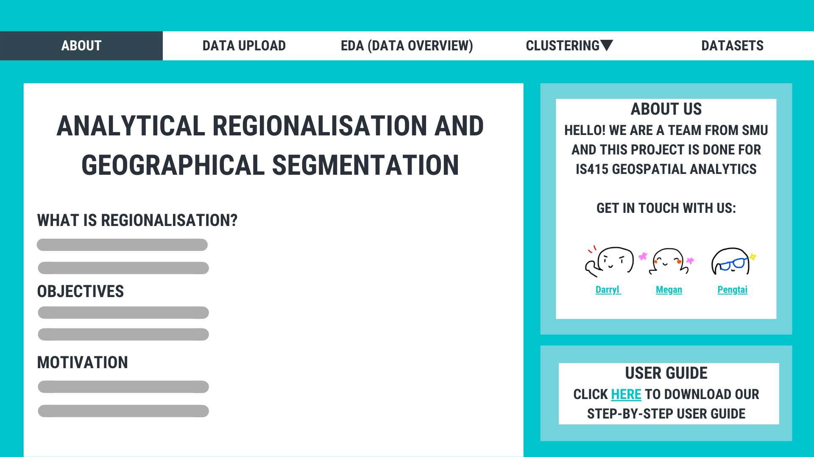
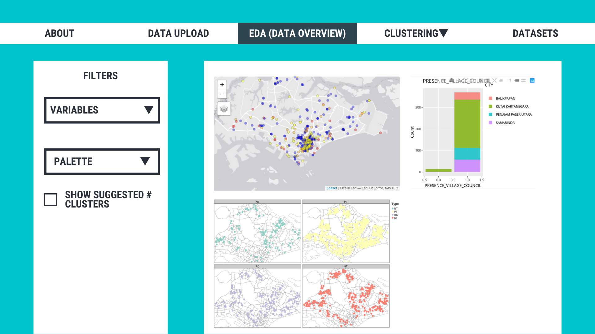
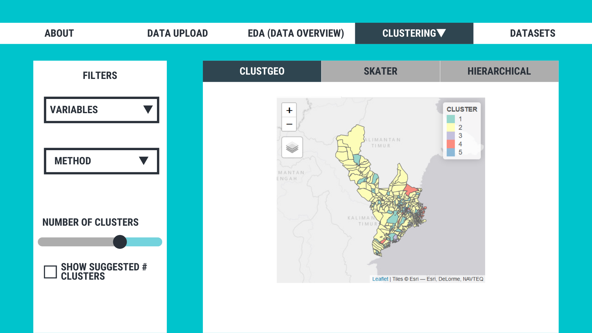
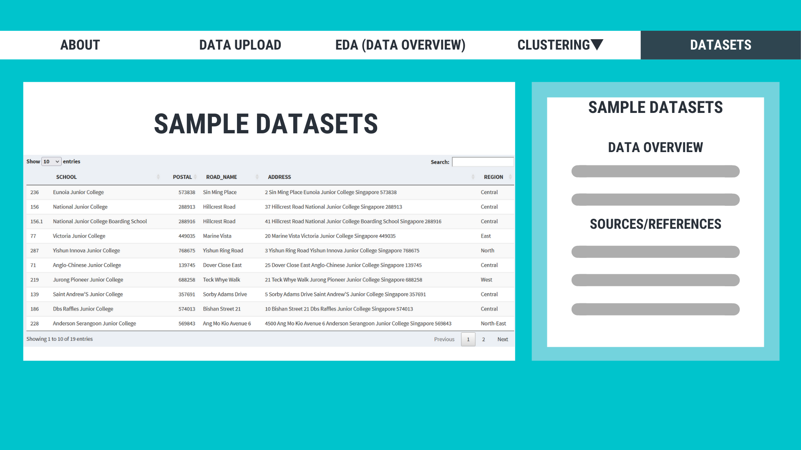
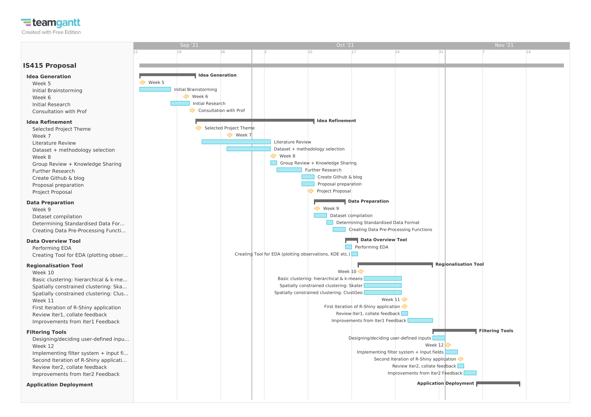
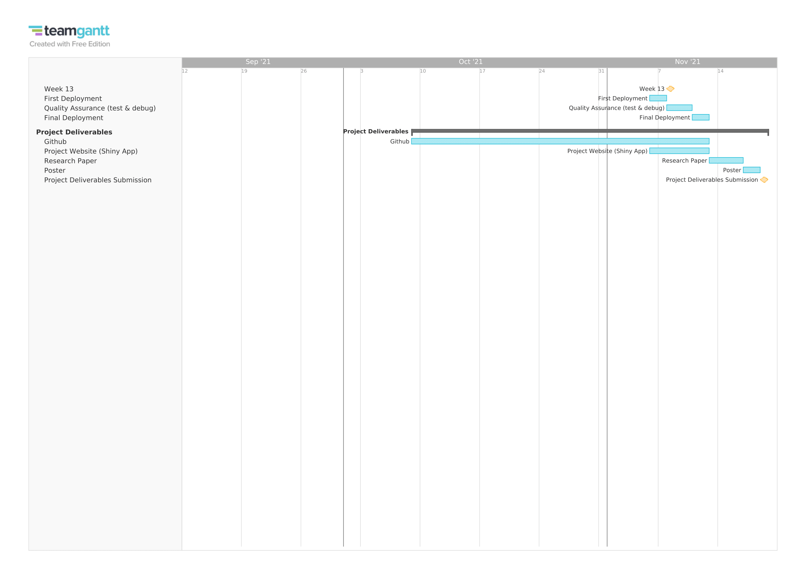

```{r setup, include=FALSE}
knitr::opts_chunk$set(echo = FALSE, 
                      eval = TRUE,
                      message = FALSE,
                      warning = FALSE,
                      fig.retina = 3)
```

```{r}
packages = c('devtools')

for (p in packages){
  if(!require(p, character.only = T)){
    install.packages(p)
  }
  library(p,character.only = T)
}
```

```{r results="hide"}
devtools::install_github("gadenbuie/xaringanExtra")
library(xaringanExtra)
```

```{r panelset, echo=FALSE}
xaringanExtra::use_panelset()
```

::::: {.panelset}
::: {.panel}
## Overview {.panel-name}

### Problem & Motivation
Comprehensive plans are required to set goals and guidelines for future growth and development. These plans are required to improve the welfare of the people and induce the creation of better social, economic and physical environments. Government bodies often create untargeted and uniform policies or strategies that hope to address the majority of the issues in the country. They often fail to consider the specific needs of each group that are across the country.

With spatial information being affected by many factors, there could be many different factors why and how occurrences of events are clustered or segregated in certain locations. We attempt to create a generalised Geographical Segmentation tool to identify clusters within any datasets to perform in-depth analysis.

Geographic Segmentation divides and separates a target market into different segments by using geographical location, to better serve and target each segment specifically.  This is often done based on geographic information and also various other factors such as climate, cultural preferences, populations and more. 

If government policies are untargeted and irrelevant, it will be costly and damaging. Geographical segmentation is an effective approach for government bodies to identify the specific needs of each segment to better serve them.

### Objectives

In this project, we will be creating a Geospatial Analytical Tool that will help users to unveil valuable insights by analyzing the spatial-temporal patterns of the different clusters of events within any datasets.

  - To visualize the distribution of the events
  - To identify clusters of events
  - To conduct Spatially Constrained Clustering Analysis and Segmentation
  
:::
::: {.panel}
## Data {.panel-name}

In order for our team to create and test the functionalities and effectiveness of our application, we will be using 2 datasets and will look to add on to this list nearing the completion of our project:

- Airbnb Listings for June 2019 and 2020 in Singapore (Downloaded from Inside Airbnb)
- Childcare Centres in Singapore (Downloaded from data.gov.sg)

:::
::: {.panel}
## Literature Review {.panel-name}

### Identifying High-risk Geographic Areas for Cardiac Arrest Using Three Methods for Cluster Analysis

#### Aim of Study: Identify high-risk census tracts, defined as those areas that have both a high incidence of out-of-hospital cardiac arrest (OHCA) and a low prevalence of bystander cardiopulmonary resuscitation (CPR), by using three spatial statistical methods.

#### Methods of Study: 
Global Empirical Bayes
Works by adjusting rates towards the global mean of the observed data with the amount of shrinkage inversely proportional to the size of the population at risk. 
Local Moran’s I 
Measures the degree to which similar observations tend to occur to each other so that local areas of similar value may be defined as a cluster
SaTScan’s spatial scan statistic
Employs a spatial scan statistic to draw circles of varying magnitude, which are set by the user, around an area, comparing the observed versus the expected outcomes in that area.

#### Learning Points:

  - Pycnophylactic interpolation was used to estimate population counts for portions of census tracts lying within the Columbus city boundaries. This allows a smooth population density surface covering the study area. 

### Spanish unemployment: Normative versus analytical regionalisation procedures*

#### Aim of Study: 

  - The study compares the two types of regionalisation approaches: (a) normative regions (towns, provinces etc.) and (b) analytical regions that are directly related w/ the analysed phenomena. For this study, two types of analytical regionalisation models were applied: a two-stage procedure based on cluster analysis and the other one based on mathematical programming. The results are that analytical regions lead to “more homogeneous regions” and are “more stable over time and with the effects of scale”. 

#### Types of Regionalisation:

  - Normative Regionalisation
    - Fixed according to political, historical or cultural factors that are officially established
    - May not be appropriate for the considered problem e.g. for regional effects of monetary & fiscal policies, results may be affected if the aggregated areas in each region are heterogeneous
  - Analytical Regionalisation
    - Functional zones designed according to geographical criteria (altitude) or socio-economic criteria (homogeneity). The goal is that areas belonging to the same region are as homogeneous are possible with respect to:
    - Geographical contiguity: The aggregation of areas (small spatial units) into regions such that the areas assigned to a region must be internally connected or contiguous.
    - Equality: In some cases, it is important that designed regions are “equal” in terms of some variable (for example population, size, presence of infrastructures, etc).
    - Interaction between areas: Some variables do not exactly define geographical characteristics that can be used to aggregate the different areas, but perhaps they describe some kind of interactions among them (for example, distance, time, number or trips between areas, etc). 

#### Methods of Study:

  - **Two-stage Strategy**
    - First stage: Conventional Clustering Model
      - Hierarchical
      - Partitional - which the paper chose, and used K-Means clustering. 
      - Mini rundown of K-Means clustering: initial centroids are explicitly or randomly assigned, then the other elements are assigned to the nearest centroid. Afterwards, initial centroids are reassigned in order to minimize the squared Euclidean distance and the process is re-iterated until there is no more change in centroids/until stopping point (e.g. number of iterations). Do note that it’s quite difficult to obtain the global optimum solution due to the randomness of the initial centroids.
    - Second stage: Cluster Revision (in terms of geographical contiguity) - if the areas included in the same cluster are geographically disconnected, those areas are defined as different regions
    - Advantage: homogeneity of regions is guaranteed by the first stage
    - Advantage: obtain evidence of spatial dependence among the elements
    - Disadvantage: number of groups depends on the degree of spatial dependence and not on the researcher criteria
    
    
  - **Mathematical Programming (RASS - Regionalisation Algorithm with Selective Search)**
    - Looks to minimising the sum of the heterogeneity measures of each class (region) r (aka total heterogeneity), forming an automated regionalisation model whose characteristics are:
    - Design a given number of homogeneous geographical units from aggregated small areas subject to contiguity requirements
    - Formulates the regionalisation problem as a linear optimisation problem, which ensures the possibility of finding the global optimum among all feasible solutions
    - More coherent solutions can be easily obtained introducing additional constraints related to other specific requirements that are relevant for the regionalisation process
    - With this model a region consists of two or more contiguous areas, which implies that any region can be formed by a unique area

#### Learning Points:

  - Normative Regionalisation may not always be appropriate due to some underlying factors
  - Analytical Regionalisation takes into account functional zones,  geographical contiguity, equality  and interaction between regions. 

### Polygon-based Regionalisation in a GIS Environment

#### Aim of Study: 

  - Despite the fact that the underlying data representing spatial entities is widely available in GIS-compatible frameworks, the task of defining areas is still mostly done manually, that is, without the use of strict algorithms with explicit parameterization. According to Openshaw (1996), one of the most essential and highly relevant spatial analysis jobs that still needs to be conceptualized for widespread application is the analysis of spatial information aggregated to zones, hence the importance of the task. This study comes out with regionalization that is well-defined and parameterized.

#### Methods of Study
  - Polygon-based regionalisation using a spatial contiguity constraint
    - Starting with a predefined set of seed polygons, a region-growing technique is used, followed by a stepwise aggregative clustering strategy.

    - History tracking
      - Each merged OTU is assigned a unique time stamp identification number in a separate table (history ID). As a result, the region-building sequence for all initial polygons = operational taxonomic units may be assessed and analyzed.

##### Example

   - **Building autonomous regions based on renewable energy consumption and sources**
    - The data is based on the combined effective production potential of renewable energy sources such as hydropower, wind, and photovoltaic energy, as well as biomass conversion and geothermal energy. After subtracting the power consumption per unit, a polygon layer represents the pooled energy supply potential.
    
:::
::: {.panel}
## Approach {.panel-name}

### Clustering: Local Moran’s I

  - Local Moran’s I is a local spatial autocorrelation statistic that identifies local clusters or local outliers
    - It is calculated as follows:
    
    - When zi and zj are the observations in deviations from the mean and wij is the spatial weight matrix element. Positive values of Ii suggest that there is a spatial cluster of similar values and negative values of Ii, represent a spatial cluster of dissimilar values
    
### Polygon-Based Regionalisation - stepwise aggregative clustering strategy

  - Interaction between segments
  - + starting seeds/manually input (eg population centres)

### Analytical Regionalisation: start with (hierarchical) 

  - There will be 2 stages to Analytical Regionalisation
    - K-means clustering
      - Iterative method to derive clusters from the dataset
      - It is an algorithm that attempts to minimize the distance of the points in a cluster with their centroid and maximize the distance between the centroids across clusters.
    - Cluster Revision
      - If areas that are within the same cluster are geographically disconnected, these areas will be defined as different regions

### Minimum spanning trees clustering algorithm (SKATER package)

  - Minimum spanning tree clustering algorithm is known to be capable of detecting clusters with irregular boundaries
  - Two minimum spanning tree (MST) clustering algorithms will be applied
    - Produce a k-partition of a set of points for any given k, then construct a MST of the point set and remove edges that satisfy a predefined criterion. This process is repeated until k clusters are produced.
    - Partition a point set into a group of clusters by maximizing the overall standard deviation reduction, without a given k value.

### Hierarchical clustering : (ClustGeo package)

  - There are two methods of hierarchical clustering.
    - Agglomerative clustering
      - Works in a bottom-up approach  
      - Each object being considered as a single element cluster(leaf). 
      - At each step of the algorithm, 2 most similar clusters will be combined into bigger clusters (nodes). 
      - This combining process is done until all points are members of just 1 single big cluster (root). 	

    - Divisive hierarchical clustering.
      - Top-down approach
      - Inverse order of Agglomerative clustering
      - Begins are the root where all objects are included in a single cluster
      - At each iteration, the most heterogeneous cluster is divided into 2
      - This process is repeated until all objects are in their own cluster

### Spatially constrained cluster analysis

  - Edge cost calculation
  - Computing spatially constrained clusters using SKATER method
  - Visualising the cluster in choropleth map

:::
::: {.panel}
## Application Sytem {.panel-name}
<center>
{width=90%}
</center>
  
:::
::: {.panel}
## Application Storybaord {.panel-name}
<center>
{width=90%}
{width=90%}
{width=90%}
{width=90%}
{width=90%}
</center>
:::
::: {.panel}
## Timeline {.panel-name}
<center>
{width=90%}
{width=90%}
</center>

For a clearer version, kindly open the image in a new tab, or [download our pdf](files/IS415_Gantt.pdf).

*Acknowledgement: Created using [TeamGantt](https://www.teamgantt.com) template*
:::
::: {.panel}
## References {.panel-name}
  - Sasson, C., Cudnik, M. T., Nassel, A., Semple, H., Magid, D. J., Sayre, M., Keseg, D., Haukoos, J. S., & Warden, C. R. (2012). Identifying high-risk geographic areas for cardiac arrest using three methods for cluster analysis. Academic Emergency Medicine, 19(2), 139–146. https://doi.org/10.1111/j.1553-2712.2011.01284.x 

  - Juan Carlos Duque & Raul Ramos Lobo & Manuel Artis Ortuno, 2004. "Spanish unemployment: Normative versus analytical regionalisation procedures," Working Papers in Economics 118, Universitat de Barcelona. Espai de Recerca en Economia. Retrieved from https://ideas.repec.org/p/bar/bedcje/2004118.html

  - Tiede, Dirk & Strobl, Josef. (2006). Polygon-based Regionalisation in a GIS Environment. Trends in knowledge-based landscape modeling. 

  - Grygorash, O., Zhou, Y., & Jorgensen, Z. (2006). Minimum spanning tree based clustering algorithms. 2006 18th IEEE International Conference on Tools with Artificial Intelligence (ICTAI'06). https://doi.org/10.1109/ictai.2006.83 
  
:::
::: {.panel}
## Contact {.panel-name}

Darryl Kwok Bing Heng: darryl.kwok.2018@scis.smu.edu.sg

Megan Sim Tze Yen: megansim.2018@scis.smu.edu.sg

Xu Pengtai: pengtai.xu.2021@exchange.smu.edu.sg

Team Github: https://github.com/boiledcactus/IS415-G3

:::
:::::
